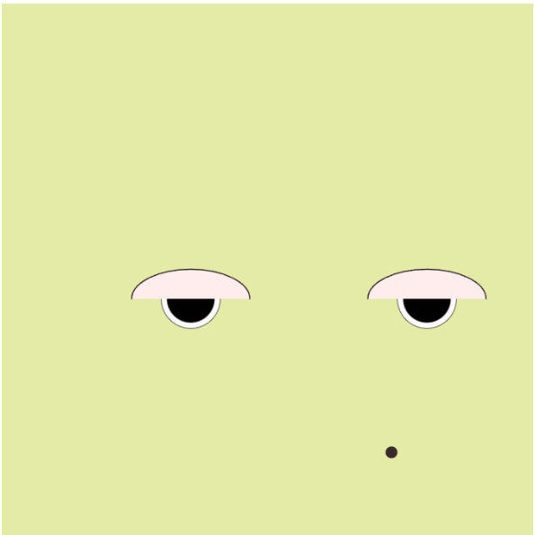
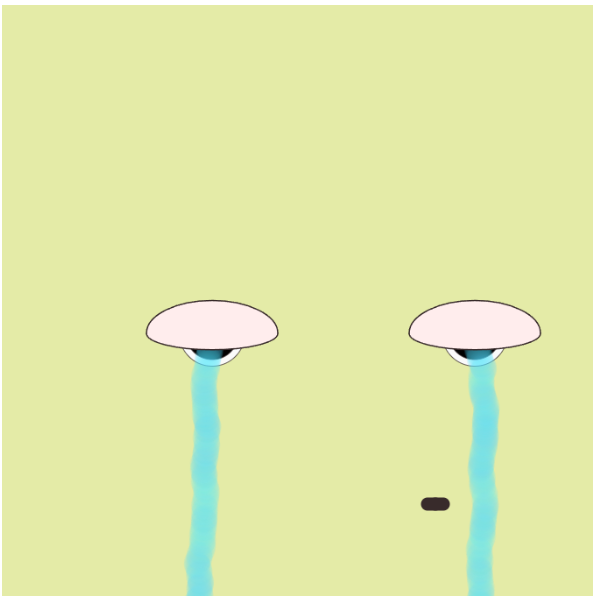

# Protoyping Conditionals Drawing 1 

Owen Dobson

[View this project online](https://halftoneluvr.github.io/CART253/Assignments/Prototyping-Conditionals/prototyping-conditionals(dwg1))

## Description

The project exsists in two sorta states: one being neutral, the other crying. I employed minor use of arrays to accomplish this on and off effect while still being able to reset every time the mouse was not actively pressed! Poor lil green guy is being tormented by the mouse !

## Attribution

> - This project uses [p5.js](https://p5js.org).
