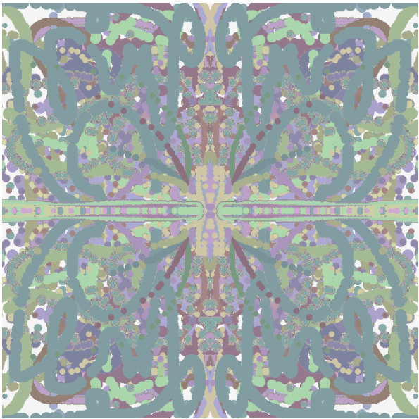

# Protoyping Conditionals Drawing 2

Owen Dobson 

[View this project online](https://halftoneluvr.github.io/CART253/Assignments/Prototyping-Conditionals/prototyping-conditionals(dwg2))

## Description

Little pastel drawing tool for the hippie-curious :) 

## Attribution

This bit should attribute any code, assets or other elements used taken from other sources. For example:

> - This project uses [p5.js](https://p5js.org).

## License

This bit could include the license you want to apply to your work. For example:

> This project is licensed under a Creative Commons Attribution ([CC BY 4.0](https://creativecommons.org/licenses/by/4.0/deed.en)) license with the exception of libraries and other components with their own licenses.