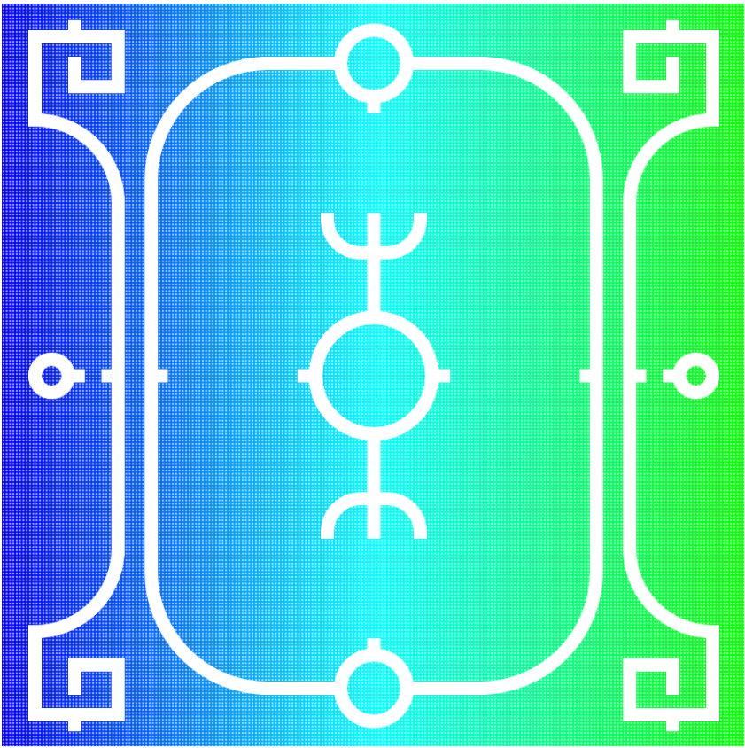

# Prototyping Assignment Drawing 2

Owen Dobson

[View this project online](https://halftoneluvr.github.io/CART253/Assignments/Prototyping-Instructions/Prototyping-Instructions(dwg2)/)

## Description

This is the second drawing for the Prototyping Assignment. It is inspired by Polish and eastern european pagan art. I wanted to leverage symmetry and java's scale function to maximize my impact. 

## Attribution

> - This project uses [p5.js](https://p5js.org).
