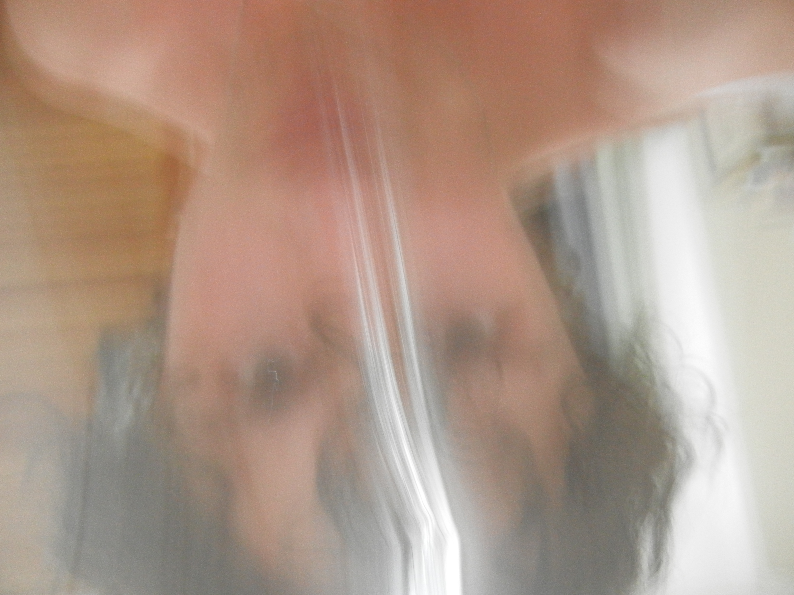
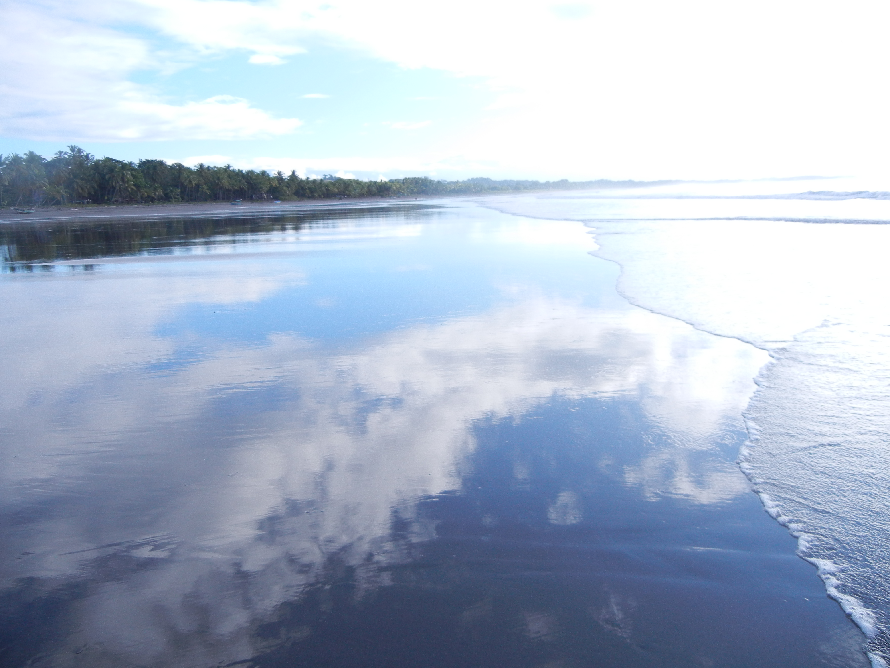
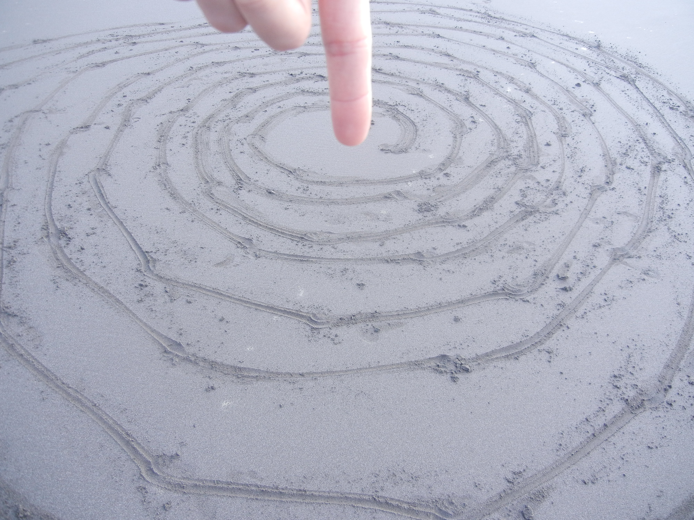
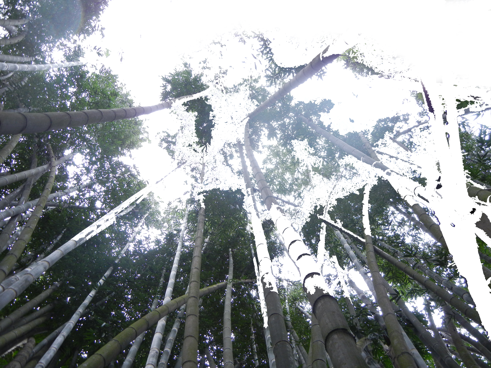

## Journal
### Journal 1 (9/17/2026)

First time properly using GitHub... I may be a little late to the club. Programming is seemingly more contentious a thing to learn, practice, and prioritize than ever. My understanding of these tools, their potential (creatively, monetarily, and structurally) has been primarily social; specifically social by way of social media. Some say it has never been more important to learn code, others proclaim that is virtually useless or a thing of the past. Due to our ever-precarious economy, we have been forced to think critically about how all our hours can be optimized; optimized for profit, efficiency, ostensibly for material gain. My question is: What ever happened to the present? Has the private, intimate, and self-contained practice of doing anything survived at all? I don't have the answer (lol). It is unfortunately too early to see if I am, in fact, sinking all my time into learning this vestigial tool. One thing is for sure though: I am enjoying myself now. This is good enough for me. I am doing *something*. I have made the repository, housed this website on GitHub (which is also apparently contentious too), have created a silly little project, and took up more cloud space... the cloud still alludes me to this day. Most of my time completing these introductory tasks have been spent listening to Imogen Heap; she is, as far as I can tell, fantastic music to code to. I honestly think I am more open to the idea of coding because of all the electronic music I listen to. IDM is undoubtedly one of my favourite genres, and I've been getting into breakbeat too, so if I'm on about Squarepusher, please feel free to look the other way. It's so odd how we live in such an aestheticized world (or maybe I'm showing my cards as a vapid aestheticist), and everything is done with the intention of being observed. We choose food based on the way it look; is it under-ripe, over-ripe, just right. Sure. But many of us also choose food based on the way the food will photograph. We listen to music album-cover-first. We buy perfume based on bottles. We buy clothes based on the photos of the clothes, not the clothes themselves. I'm not trying to get into a meta-conversation too much, or even proclaim "Ceci n'est pas une pipe" as René Magritte did, I guess I'm just overwhelmed and confused and want/need to know I'm not going insane in this visual supremacy. Anyways, I am very amped to learn JavaScript and start thinking about visuals and the generation of visual-auditory media in a new way. Peace :)

### Journal 2 (9/23/2026)

In creating these prototypes, I had to confront my intuition. I am so used to image-making in a tactile way that writing the visuals into existence was foreign and obfuscating to me. The process of reaction to a gesture – or in this case, line of code – was more delayed and convoluted by the different windows and tabs I had running on my laptop. One morning, I devised a plan to create a representational drawing of a branzino (yes, the fish) on a plate with its usual accoutrements (lemon, cherry tomato, onion, olive oil, etc.). What would have been relatively easy for me to generate with my hand now seemed tedious. I understand that my understanding of programming is elementary, but this intense struggle made me realize something: you cannot fight through the process. Reluctantly, I started from scratch, but I had a new idea in mind. I should try to work with the software, and not against it. I decided then to create a tartan type of pattern, leveraging the transparency effects or alpha values, and clean straight lines that felt more natural in code. I could, effectively and almost seamlessly, create a grid that would have been difficult to produce physically. Similarly, in my pagan-inspired polish-esque pattern piece, I used the scale function to maximize the effect of my work. I manually created a quarter of the drawing with lines and arcs, then scaled them to create the symmetrical final piece. I also used neon colours, which are not as accessible in real life, but present beautifully on a digital interface. Essentially, yes, work smarter not harder, but also really consider the flow of a given medium, and how that flow can guild your creative process.

### Journal 3 (10/2/2026)

Well, well, well, things have certainly gotten more complex, haven’t they. With all these variables, I feel ready to contribute to a planned economy or something! But seriously, adding variables to the mix really does allow for some nice movement. It makes me itch with anticipation for user input. While creating these drawings, I was thinking more about the process of watching them develop than the final product per se. I also really enjoyed employing filters throughout the process because they helped me observe the drawings in new ways. BLUR was particularly nice to observe movement in process and create an ephemeral form in my first drawing. I also love POSTERIZE (even though it isn’t in any of the final products). I would employ it often to get a real read on my overlapping and transparent shapes. Variables were helpful for obvious reasons like organization and iteration, but I just love how much life you can instill in a piece when a variable undulates slightly. A lot of time making these drawings was actually spent changing variables and watching how the drawing reacted… very much so a game of trial and error, usually with a happy accident somewhere in there. My code is not that long, and admittedly simplistic, but I think the drawings all stand alone as visually pleasing squares to observe develop. 

### Journal 4 (10/7/2026)

For this journal I will try to be more critical of my process and frank about things… just as a fun treat :)  So, frankly, I really love the drawings that I have made – especially Drawing 2 and 3. That said, I do not think that my drawings were well-suited to the assignment. I got carried away with the visions I had for these “drawings” and used whatever means necessary to achieve them, even it that was out of the scope of the assignment. For the first drawing, I did use conditionals, but admittedly, most of my time was spent trying to get a noisy effect on the tears and learning how to use trails. Cute, but maybe out of scope. My second drawing has a different sort of ilk, being that it is totally dependent on events to exist as anything more than a plain canvas. I learned a lot about the way event functions operate, better understood trails, and even experimented with new colorModes; however, again, I feel that it could have been more focused on the conditional aspect of the assignment. Third Drawing: I think this has quite a nice effect. It reads to me like some of the UI that has been popular in recent years with organic and flowing forms (think Apple’s liquid glass rollout or even their stock backgrounds). I mean that is obviously self-flagellating, and I understand how simple this is in comparison, but I am nevertheless happy with the end result. Maybe it evokes Canva, and even that would be fine by me. Critically, I think it is important to acknowledge that most of the appeal of the project is due to the use of filters and trails, which are, once again, sorta out of the scope of a conditionals assignment. On a more technical note, I found the use of if-else statements really helpful in creating bouncing effects (to approach and recede from a given value), and I tried to make precise choices about all the values (colour, size, form) in these drawings. All of this to say, I am going to be more thoughtful about the intentions and learning incentives of these assignments, whilst still trying to fulfill the vision I have for them. 